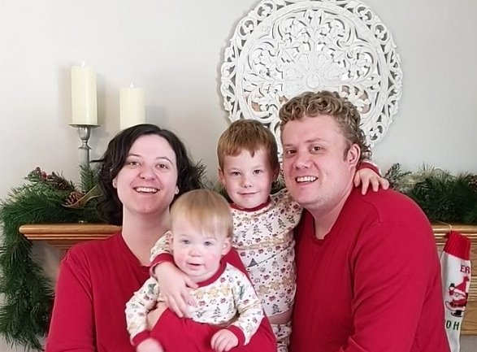

# Jordan Davidson

<div style="display: flex; justify-content: space-between">
  

  <ul>
    <li><a href="https://resume.fromnibly.com">Website</a></li>
    <li><a href="https://github.com/from-nibly/">GitHub</a></li>
    <li><a href="https://www.linkedin.com/in/jordandavidson3102/">LinkedIn</a></li>
    <li><a href="mailto:jordan@davidson.house">jordan@davidson.house</a></li>
  </ul>
</div>

---

# Bonus Content Below

:arrow_down:

---v

### You found the first bonus content

:speak_no_evil:

- First to post the full sequence of emojis at the end of each bonus content
  gets a high five
- There are 10 emojis in the sequence
- Pasting the words instead of the emoji counts

---v

# Flashlight

:flashlight:

---

# Work History

---

# :hospital: Novarad :hospital:

- :point_left: Manual QA tester
- :bulb: Moved to automation
- :100: Built first database test framework

---v

## Automation

- Used whatever the Windows equivalent of Selenium was
- Took screenshots and compared them to historical screenshots
- Automated similar screens together

---v

## Database Tests

- Created the test framework for running database tests
- This was during a switchover from MSSQL server to Postgres
- "Managed" a team that was writing the tests

---v

# Fax

:fax:

---

# :telephone: Jive Comm. :telephone:

- :fax: Raspberry Pi phone testing system
- :minidisc: Spin up postgres docker containers

---v

## Dreidel

- Spin up your apps dependencies on a shared server with docker containers
- Run your tests after it's all up
- Tear it all down

---v

## Raspberry Pis

- Distributed cluster of Raspberry Pi's connected to physical phones
- Check out phones with bankers algorithm
- Make a phone call from one to the other
  - Text to speech
  - Play audio on one phone
  - Record audio on the other
  - Speech to text
  - Compare the text after the test is done

---v

# Crown

:crown:

---

# :chart_with_upwards_trend: Domo :chart_with_upwards_trend:

- :hatching_chick: Delivery Engineering
- :boat: Ephemeral Developer Environments
- :penguin: Linux Desktop

---v

## Eph Dev Envs (Drydock)

- Back in kubernetes 1.4 days
- Invented
  - Templating
  - Network Tunneling
  - Storage Snapshots
- Used by the whole company
- Ran in CI/CD pipelines
- Took 5 minutes to get a replica of prod

---v

## Linux Desktop

- Asked IT if I could install Linux on my Windows machine
- Used Linux for 2 years
- Ended up getting Linux approved as a desktop OS
- Many devs switched to Linux after that

---v

# Cherries

:cherries:

---

# :lock: Parakeet/Brivo :lock:

- :hammer: Scrappy Developer environments
- :bug: Jira PROJ-1 Bug
- :see_no_evil: Monitoring and CI/CD

---v

## Scrappy Dev Envs

- Company had no way of testing locally
- Created a system using k3d that would spin up dependencies on develop laptops
- Way jankier than Drydock (better than testing in prod)
- Used by the whole web team

---v

## Jira PROJ-1 Bug

- The first bug in the system
- No one could figure it out
- Was an initiation for new employees to try and fail to fix that bug
- Fixed it :shrug:

---v

## Monitoring and CI/CD

- Implemented an alert system with opsgenie
- Implemented a CI/CD pipeline on bitbucket
- Started migration to kubernetes

---v

# Car

:car:

---

# :gift: GoGive :gift:

- :dollar: Own Startup
- :muscle: Full stack
- :sparkles: Design work
- :100: Got an integration with sendoso

---v

## Responsibilities

- Went on sales calls
- Got users set up with the app
- Wrote the whole dang app
- Provisioned infrastructure (used kubernetes :facepalm:)
- Designed the app interface

---v

## Successes

- Ran a campaign for Entrata
- Donated ~ $20K to charities

---v

## The end

- Had a :baby:
- Ran out of :dollar:
- Product didn't make sense

---v

# Recycle

:recycle:

---

# :dollar: TAB Bank :dollar:

current job

- :mag: Deep discovery
- :package: Migrations
- :pager: Monitoring
- :rocket: Rebrand to Platform Engineering

---v

## Taking over

- Overlapped with previous engineer for 9 months
- Little Documentation
- Lots of custom vms
- Lots of custom scripts
- Lots of custom everything
- Everything was out of date

---v

## Migrating

- Picked up an old project to migrate to kubernetes
- Migrated from jenkins to GitHub Actions
- Migrated to ACME certificates
- Stood up prometheus, alertmanager, grafana, Ops Genie.
- Migrated to loki

---v

## Rebrand to Platform Engineering

- Self service deploys with approvals
- Self service monitoring
- Self service secrets management
- Deploys in lockstep with merges

---v

## Reduce Downtime

- Downtime reduced to negligible amounts
- Business no longer complains about outages

---v

# White Check Mark

:white_check_mark:

---

# Passions

- Streamlining Processes
- Codification of Knowledge
- Getting to the Root Cause
- Solving Problems

---v

> When I was a little kid I strung a bunch of coolers together to make a train
> so I could help my mom bring the groceries in from the car in one trip

---v

> There are chore lists all over the house, so I can help my wife without having
> to bug her about what needs to be done or how to do it

---v

> I have reusable packing lists for trips so I don't forget anything. I can't
> check it off until it's in the car.

---v

> This slide show was made in reveal.js so I could use markdown instead of
> dragging stuff in google slides.

---v

```typescript
let rootCause == null;
let causes = [];
while (rootCause == null) {
  causes = bangHeadAgainstWall();
  rootCause = causes.find(cause => cause.parent == null);
}
nap();
```

---v

# Panda Face

:panda_face:

---

# :family: Not Work :video_game:

- :baby: :baby: Married with 2 kids (5, and 18m)
- :computer: Home Lab
- :video_game: Video games when I can
- :game_die: Board games on Fridays
- :octocat: Open Source Projects (optd)

---v

## Family



---v

## Home Lab

- 3x Dell r720XD servers
- K3s on Nixos
- Rook/Ceph for storage
  - Can yoink a hard drive with 0 down time
- Runs Plex, Nextcloud, Kitchenowl, a blog, and a whole bunch of other stuff
- Cuelang based K8s automation with ArgoCD

---v

## Video Games

- Currently playing through "The Legend of Dragoon" on an emulator device
- I love Satisfactory (it's just like the most interesting parts of programming)
- Starting to play Minecraft with my oldest kid

---v

## Board Games

- I play a lot of Archduke
- I've made my own board game called Gradient (we should play it some time)

---v

## OptD

- CMS for Platform Engineers
- Written in Node.js, backed by Postgres
- Entity/Document Oriented
- Use executable scripts to extend functionality with hooks etc
- Long way to go but it's making progress

---v

# Honey Bee

:honeybee:

---

# Skills

- Typescript / Python
- Kubernetes
- React / Tailwind
- Linux / Bash
- Ansible / Terraform / Cuelang
- AWS / GCP / Bare Metal

---v

# Skills (in no particular order)

|           |                |               |              |
| --------- | -------------- | ------------- | ------------ |
| NuShell   | MaterialUI     | Bootstrap     | CSS          |
| GitOps    | HTML           | git           | Github       |
| BitBucket | GitHub Actions | Prometheus    | Grafana      |
| Loki      | AlertManager   | Ops Genie     | Postgres     |
| Jenkins   | Docker         | Dagger.io     | K3s          |
| Rook      | Ceph           | NixOS         | ArgoCD       |
| Helm      | Kustomize      | Raspberry Pi  | websockets   |
| REST      | Tilt           | Ruby          | Golang       |
| Spring    | Electron       | Gulp          | Haproxy      |
| Nginx     | OIDC           | Okta          | Auth0        |
| JWT       | Certificates   | ELK           | Vim          |
| Prolog    | ACME           | FluxCD        | Django       |
| NestJS    | Testing        | GKE           | EKS          |
| Direnv    | grep           | Bun.js        | vim          |
| prettier  | Compilers      | DI/IOC        | Java         |
| Scala     | Soldering      | Plumbing      | Making Lists |
| PO/PM     | Google Docs    | Communication | CI/CD        |

---v

# Ocean

:ocean:

---

# Quirks

- :thought_balloon: I have ADHD
- :penguin: I use a tiling window manager on Linux
- :memo: I use vim
- :wrench: I "built" my own keyboard
- :speaker: My speakers are made out of ceiling tiles

---

<h1 class="fragment fade-in-then-semi-out">
Questions?
</h1>

<h1 class="fragment fade-in-then-semi-out">
Comments?
</h1>

<h1 class="fragment fade-in-then-semi-out">
Concerns?
</h1>
